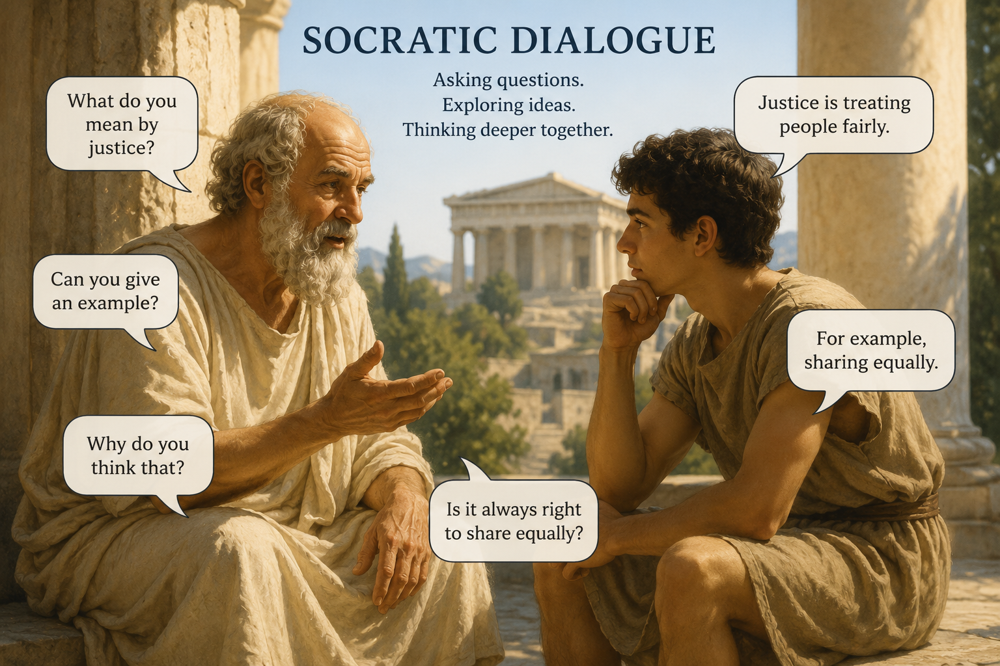

## Key features
- RAG based query search using FAISS and LangChain.
- Socratic dialogue style tutor for learning concepts using LangGraph.
- Ask user concept related question, give hint if the answer is not satifactory.


## Quick Start

Run the application with
```
docker-compose up
```


## Key runtime pieces

- Authentication
  - Implemented via JWT; configured in core/config.py and routes in api/auth.py.

- Scraping & Ingestion
  - core/scrap.py extracts book structure (chapters, topics) and raw text for indexing.

- Persistence
  - PostgreSQL is used for structured data. Connection string is set via DATABASE_URL env var.

- Vector search & LLM
  - llm/vector.py handles embeddings and vector store.
  - llm/generate.py composes prompts, calls the LLM, and formats outputs.


